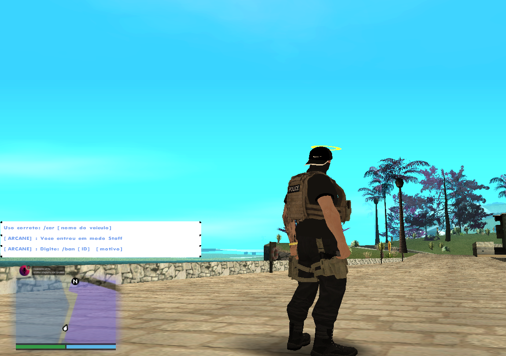

# InfoBox para SA-MP
 
Uma INCLUDE de InfoBox para o San Andreas Multiplayer (SA-MP) e Open Multiplayer (OMP) que permite exibir mensagens personalizadas na tela dos jogadores.

## Descrição

Este projeto implementa uma biblioteca que possibilita a criação e exibição de TextDraws (InfoBoxes) para jogadores no SA-MP. As mensagens podem ser personalizadas em termos de texto, cor e duração na tela. O sistema permite até 10 InfoBoxes simultâneas e garante uma experiência de usuário mais interativa.

## Funcionalidades

- Criação de até 10 TextDraws simultâneos.
- Exibição de mensagens personalizadas para cada jogador.
- Destruição automática das InfoBoxes após 7 segundos.
- Sons de notificação ao exibir as mensagens.

## Instalação

1. **Clone o repositório**:

   ```bash
   git clone https://github.com/seu-usuario/seu-repositorio.git
   ```

2. **Navegue até a pasta do projeto**:

   ```bash
   cd seu-repositorio
   ```

3. **Copie o arquivo `infobox.inc` para a pasta** `pawno/include` **do seu servidor SA-MP**.

4. **Inclua a `infobox.inc` em seu arquivo** `gamemode.pwn`:

   ```pawn
   #include <infobox>
   ```

## Uso

Para criar uma InfoBox, utilize a seguinte função:

```pawn
CreateInfoBox(playerid, "Sua mensagem aqui");
```

### Exemplo de Comando

Aqui está um exemplo de comando que exibe uma InfoBox para o jogador:

```pawn
CMD:infobox(playerid, params[]) {
    new text[] = "Bem-vindo ao servidor!";
    CreateInfoBox(playerid, text);
return 1;
}
```

## Contribuições

Contribuições são bem-vindas! Para contribuir com este projeto, siga as etapas abaixo:

1. Faça um fork do repositório.
2. Crie uma nova branch com suas alterações.
3. Envie um pull request.

## Licença

Este projeto é licenciado sob a MIT License. Veja o arquivo [LICENSE](LICENSE) para mais detalhes.

## Atualizações

A biblioteca pode sofrer atualizações e mudanças ao longo do tempo. Fique atento às notas de versão e melhorias que podem ser implementadas para garantir a melhor experiência possível.
